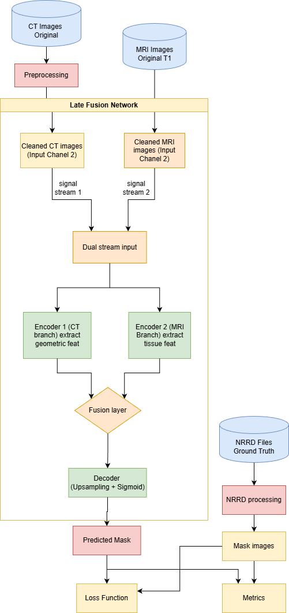
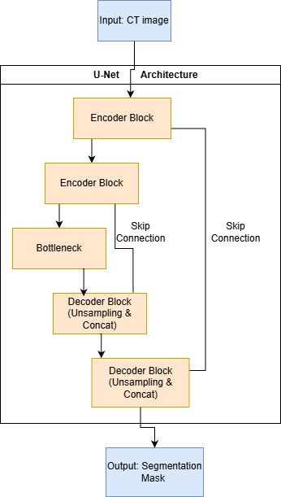
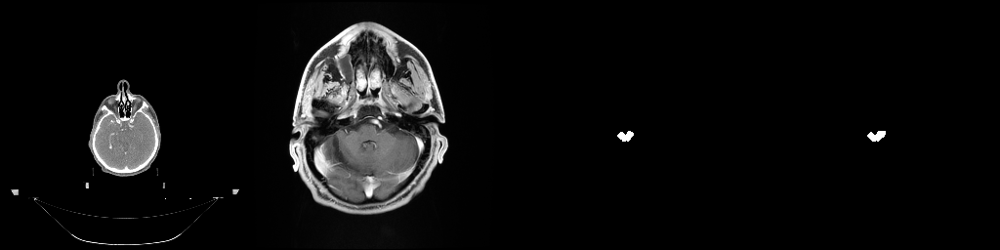

# GAN-Augmented Dual-Stream Late Fusion U-Net for Medical Image Segmentation

## Overview
[cite_start]This repository contains the official implementation of a hybrid framework that integrates a Generative Adversarial Network (GAN) with a Dual-Stream Late Fusion Segmentation Network[cite: 3]. [cite_start]The system is designed to address the challenges of soft-tissue segmentation in Computed Tomography (CT) scans, specifically targeting the brainstem[cite: 26, 30]. [cite_start]By synthetically generating the missing MRI modality from the PDDCA dataset, the model significantly enhances segmentation performance and accuracy[cite: 4].

## Architecture

### Proposed Dual-Stream Late Fusion Network

[cite_start]The proposed workflow consists of three interconnected pipelines[cite: 5]:
1. [cite_start]**GAN-based MRI Synthesis:** A Generative Adversarial Network trained on an external unpaired MRI dataset learns the domain adaptation mapping from CT to MRI[cite: 11, 12]. [cite_start]During inference, the U-Net based Generator takes preprocessed CT images as input to synthesize the corresponding "Synthetic MRI"[cite: 51, 52, 53].
2. [cite_start]**Dual-Stream Late Fusion U-Net:** A segmentation network featuring two specialized parallel encoding branches[cite: 73, 74]:
   * [cite_start]**CT Stream (Geometric Encoder):** Processes the original CT data to extract high-fidelity geometric features, such as bony boundaries and rigid landmarks[cite: 75, 76].
   * [cite_start]**sMRI Stream (Semantic Encoder):** Processes the Synthetic MRI to extract soft-tissue semantic features and inter-organ contrast information[cite: 78, 79].
3. [cite_start]**Late Fusion & Decoding:** The distinct feature maps from both streams are merged via channel concatenation at the network's Bottleneck (maintaining a 128x128 spatial dimension) before being upsampled by the Decoder to reconstruct the final predicted mask[cite: 84, 85, 86, 87].

### Baseline Single-Channel U-Net (For Comparison)

[cite_start]For performance comparison, a standard single-channel U-Net was implemented to process the CT images directly[cite: 165, 166].

## Dataset Preparation
[cite_start]The system utilizes two distinct datasets to train the Generative and Segmentation networks separately[cite: 26]:
* [cite_start]**Source Domain (Segmentation):** The PDDCA 2015 dataset (MICCAI 2015 Head and Neck Auto-Segmentation Challenge), comprising 3D CT scans from 48 patients[cite: 27, 29]. 
* [cite_start]**Target Domain (GAN Training):** Brain MRI Images dataset (Kaggle), comprising approximately 3,000 unpaired MRI slices to learn the MRI intensity distribution[cite: 31, 32, 33].

## Loss Function
[cite_start]To overcome extreme class imbalance where the background class constitutes over 98% of the image area, the network is optimized using a Hybrid Loss strategy[cite: 96, 103]:

[cite_start]$L_{Total} = \lambda_1 L_{BCE} + \lambda_2 L_{Dice}$ [cite: 105]

[cite_start]This objective function combines Binary Cross Entropy (BCE) to establish a smooth error surface for rapid convergence, and Dice Loss to heavily penalize False Negatives on small target structures, forcing the network to learn detailed boundary features[cite: 116, 124].

## Experimental Results
[cite_start]The Late Fusion Multi-modal model was evaluated against a single-channel Baseline U-Net over 200 training epochs[cite: 169, 191]:

| Metric | Baseline U-Net (CT Only) | Late Fusion U-Net (Proposed) |
| :--- | :--- | :--- |
| **Accuracy** | [cite_start]99.81% [cite: 171] | [cite_start]99.97% [cite: 193] |
| **F1-Score** | [cite_start]84.38% [cite: 171] | [cite_start]97.50% [cite: 193] |
| **Best Dice Score** | [cite_start]96.58% [cite: 171] | [cite_start]97.50% [cite: 193] |
| **Train Loss** | [cite_start]36.69% [cite: 171] | [cite_start]2.87% [cite: 193] |
| **Val Loss** | [cite_start]39.04% [cite: 171] | [cite_start]3.40% [cite: 193] |

**Key Findings:**
* [cite_start]**Faster Convergence:** The proposed model demonstrated exceptional stability, with the training loss dropping rapidly to 0.0287 within the first 5 epochs[cite: 196, 197].
* [cite_start]**Enhanced Feature Extraction:** The Fusion model achieved a training loss reduction of approximately 45% compared to the baseline[cite: 200].

### Visual Evaluation

[cite_start]Visual evaluations confirm that the multi-modal approach resolves segmentation ambiguities well, maintaining highly accurate predictions for positive cases while effectively demonstrating high specificity on negative cases[cite: 226, 248].
